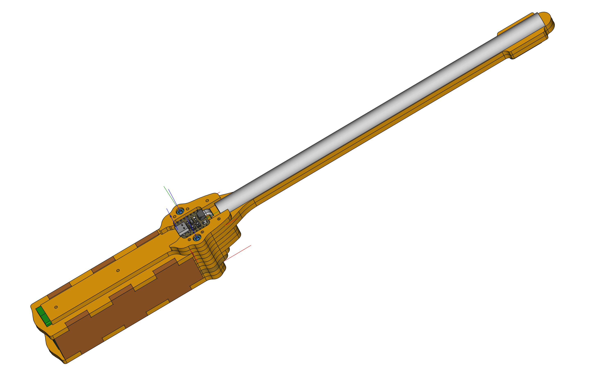

# cp_magic_painter - Malen mit Licht 
POV (Persistance Of Vision) Zauberstab

## documentation
have a look at [the documentation](https://s-light.github.io/cp_magic_painter/docu/)

Wichtige Dokumentations-Seiten:
- [Firmware Aktualisieren](https://s-light.github.io/cp_magic_painter/docu/update_firmware/de.html)
- [Bilder Vorbereiten](https://s-light.github.io/cp_magic_painter/docu/prepare_images/de.html)
- [Bedienung](https://s-light.github.io/cp_magic_painter/docu/usage/de.html)

## origin
this project / Workshop was first created for the [`Make Your School MakerFestival 2023`](https://www.makeyourschool.de/maker-festival/)

it is based on these two excellent Adafruit tutorials:
- [circuitpython painter](https://learn.adafruit.com/circuitpython-painter)
- [clue light paintstick](https://learn.adafruit.com/clue-light-paintstick)