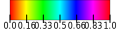

# Bedienung

## Grundlagen

der Zauberstab hat zwei verschiedene _Modi_:

-   RGBLamp
-   POVPainter

Umschalten kann man diese mit dem kleinen Taster knapp überhalb der USB Buchse.

<!-- TODO: FOTO EINFÜGEN! -->

Auf dem Controller gibt es des weiteren eine kleine LED die in verschiedenen Farben leuchten kann.
ich nennen sie `status_led`

Die _Touch-Tasten_ sind deaktiviert.
Sie funktionieren leider zu unzuverlässig.

Dafür ist kann der Stab nun mit (einfachen) _Gesten_ eingestellt werden.
Was genau welche Geste bewirkt kannst du unten im Abschnitt [Modi](#modi) nachlesen
Alle Gesten sollten aus einer Horizontalen Ruhe-Position angefangen werden.

Der Stab kennt:

-   `TILT_RIGHT`
-   `TILT_LEFT`
-   `SHAKE_Y`

### `TILT_RIGHT` & `TILT_LEFT`

-   halte den Stab ruhig in einer Horizontalen Position.
-   `status_led` sollte _hell_ grün leuchten
-   nun den Stab um die eigene lange Achse langsam nach Rechts oder Links drehen/kippen
-   wenn weit genug gekippt wurde wechselt die `status_led` zu
    -   gelb für Links
    -   türkis für Rechts

### `SHAKE_Y`

Gut Festhalten!!
einfach _seitlich_ schütteln / wedeln.

siehe dieses Video:
<video src="./../mode%20POVPainter.mp4" controls title="Mode: POVPainter - showing two different images"></video>

## Modi

### RGBLamp

einfach Lampen Funktion

die Farbe der Lampe hat einen leichten *Schwebe*-Effekt.
Sie variiert in einem Voreingestellten Rahmen und gibt so ein bisschen *lebendigkeit*

-   `TILT_RIGHT` → Helligkeit + 10%
-   `TILT_LEFT` → Helligkeit - 10%
-   `SHAKE_Y` → keine Funktion

<video src="usage%20gesture%20brightness%20short.mp4" controls title="brightness change"></video>


##### Besonderheit bei der Helligkeit:
um auch sehr dunkle *nachtlicht* Helligkeiten zu ermöglichen, 
werden unter 50% nur ein teil der LEDs genutzt. 
bei <=10% ist damit dann nur noch eine einzelne LED an.


### POVPainter

Persistance Of Vision = Bilder Malen :-)

jedes mal wenn ein Bild _geladen_ wird wird der Vortschitt mit einem Grünen _Lade-Balken_ auf den LEDs dargestellt.

dies passiert beim ersten starten des Modus und beim Wechseln des Bildes.

Einstellungsoptionen:

-   `TILT_RIGHT` → lade nächstes Bild.
-   `TILT_LEFT` → keine Funktion
-   `SHAKE_Y` → Zeichne Bild

Wichtig: beim `SHAKE_Y` braucht es einen kurzen moment bis das Bild erscheint.
in dieser Zeit kalibriert sich der Stab auf deine Wedel-Geschwindigkeit.
Wenn du sehr hohe Schwankungen deiner Wedel-Geschwindigkeit hast kann es sein das das Bild zwischendurch aus geht..
Probiere dann einfach _konstanter_ zu Wedeln...

## Weitere Einstellungen

es gibt noch weitere Einstellungsoptionen! Diese kann man allerdings nur über die `config.py` Datei anpassen.

- Diese Datei findest du wenn du den Stab per USB an den Computer anschließt.
- der Stab meldet sich als USB-Speicher-Stick mit dem Namen `CIRCUITPY`.
- Dort findest du die Datei `config.py`.
- öffne diese am besten mit dem `MU` editor.
    - dafür das Programm `MU` starten
    - falls die *Modus* abfrage kommt `Adafruit CircuitPython` auswählen
    - dann oben auf `Load` clicken. 
    - dann das Laufwerk `CIRCUITPY` auswählen (wahrscheinlich ist es schon ausgewählt!)
    - und die Datei `config.py` Öffnen.
- immer wenn du eine Änderung gemacht hast kannst du auf `Save` drücken.
- damit wird die Datei auf den Zauberstab gespeichert → dieser startet einmal neu und deine Änderungen sind wirksam.

Diese sieht in etwa so aus:
```python
config = {
    # in wich mode to start: (RGBLamp | POVPainter)
    # "start_mode": "RGBLamp",
    "start_mode": "POVPainter",
    "POVPainter": {
        "brightness": 1.0,
    },
    "RGBLamp": {
        "brightness": 0.2,
        # effect duration in seconds
        "effect_duration": 10 * 60,
        #
        # colors
        # https://learn.adafruit.com/fancyled-library-for-circuitpython/colors#hsv-colors-2981215
        # only specifying Hue for fully saturated color..
        # purple
        # "color_range": {
        #     "min": CHSV(0.50),
        #     "max": CHSV(0.9),
        # },
        # warm orange
        "color_range": {
            "min": CHSV(0.08),
            "max": CHSV(0.12),
        },
        # extra effects...
        "extra_effects": {
            # y_to_brightness can be used for a *candle like* effect
            "y_to_brightness": False,
            # "y_to_brightness": (0.3, 0.7),
        },
    },
}
```

ich hoffe das die meisten einstellungen selbst-erklärend sind..
wichtig ist:
es gibt für beide modi jeweils eine eigene Helligkeits einstellung:
`brightness`
der Werte Bereich geht von 0.0 bis 1.0 - du kannst da z.B. `0.01` für sehr dunkel rein schreiben.

### `povpainter`
beim `povpainter` ist hier wichtig zu beachten: 
bei niedrigen werten (z.B:`0.1`) geht die *Farb-Auflösung* verloren → weniger darstellbare Farben.
Um also alle Farben sehen zu können braucht es *mittlere* Werte. 
Ich empfehle `0.6` das passt meist..

### `rgblamp`

#### Besonderheit bei `brightness`
um auch sehr dunkle *nachtlicht* Helligkeiten zu ermöglichen, 
werden ab werten von unter `0.5` nur ein teil der leds genutzt. 
bei `0.1` ist damit dann nur noch eine einzelne LED an.

#### Einstellen der Farbe und Effekt-Geschwindigkeit
wie oben beschrieben *Schwebt* / *Wabbert* die Farbe etwas..

die Geschwindigkeit lässt sich bei `effect_duration` einstellen.
Standard sind `10 * 60` Sekunden (= 10minuten)

die Farben kannst du mit der config `color_range` einstellen.
dort gibt es eine `min` und eine `max` Farbe.
```python
        "color_range": {
            "min": CHSV(0.08),
            "max": CHSV(0.12),
        },
```
diese ist als HSV wert angegeben.
Was ist das?
- Hue → Farb-Ton
- Saturation → Sättigung (wie viel weiß Anteil)
- Value → *Helligkeit

die Werte für den Farb-Ton kannst du in dieser Grafik ablesen:


daraus ergeben sich für das Beispiel oben Rot bis Orange Töne..

Vielleicht fragst du dich nun warum bei `"min": CHSV(0.08),` nur ein Wert steht?
ganz einfach: das ist `Hue`. für S und V werden die *Standard* Werte von `1.0` angenommen.
damit ergibt sich eine vollständig Gesättigte Farbe.
wenn du mehr etwwas weißes haben möchtest ginge das z.B. so:
```python
        "color_range": {
            "min": CHSV(0.66),
            "max": CHSV(0.66, 0.2, 1.0),
        },
```
das würde ein Tief Blau bis Weiß-Blau ergeben.
es macht hier durch aus sinn etwas mit den Farben aus zu probieren & zu spielen :-)

Wenn du es gaaaaaaaaannnzzz Bunt magst - probiere doch mal
```python
        "color_range": {
            "min": CHSV(0.0),
            "max": CHSV(1.0),
        },
```

ganz unten findest du dann noch ein `extra_effects`.
```python
        # extra effects...
        "extra_effects": {
            # y_to_brightness can be used for a *candle like* effect
            "y_to_brightness": False,
            # "y_to_brightness": (0.3, 0.7),
        },
```
dort habe ich etwas lustiges ausprobiert...
der *effect* `y_to_brightness`  mapped (*überträgt*) den beschleunigungs-sensor wert der y Achse auf die Helligkeit.
der Werte Bereich des Helligkeit für das mappings ist im beispiel mit 0.3 bis 0.7. angegeben: 
- 0.3 minimale Helligkeit bei fast keiner  Bewegung
- 0.7 maximale Helligkeit bei sehr starker Bewegung

Dadurch kann man einen *Kerzen-Flicker-Effekt* erzeugen - 
wenn man den Zauberstab z.B. in einer *Sankt-Martins* Laterne durch die Gegend trägt...
(das war der Ursprung für den Effekt...)